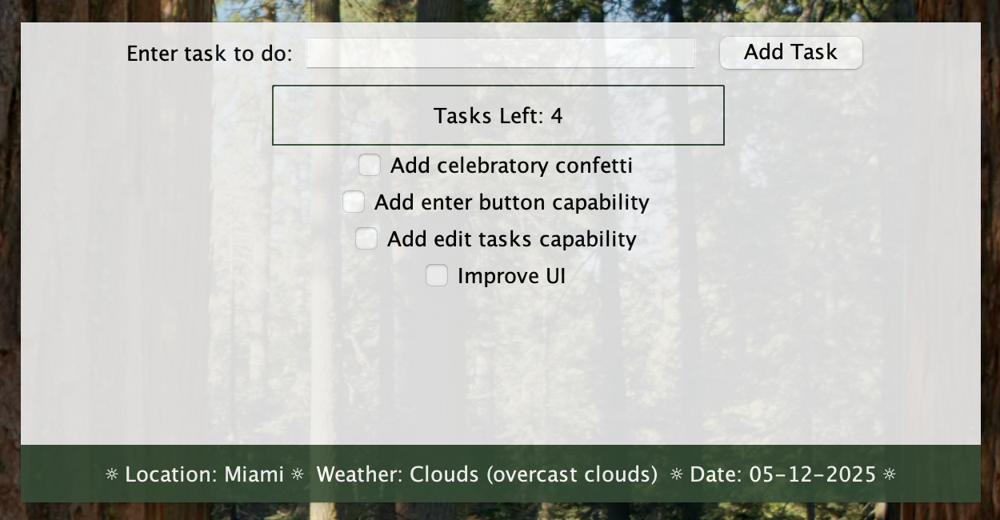

# To-Do List App ☀️

A cozy, desktop-based to-do list app built with Java Swing! This app lets you track your tasks, earn "rewards" as you complete them, and get a constant weather and date update.

Contributor: Sofia Guarisma

**Repository Link**: _[GitHub Repository](https://github.com/sguarisma/todo_widget.git)_

---

## Features

- Add and check off tasks using an interactive checklist
- Saves your tasks locally to a `todos.txt` file so nothing gets lost
- Tracks how many tasks are left before a reward
- Displays current weather for Miami with the date (leveraged external documentation and the Open Weather Map API references for weather data)
- Draggable window with a translucent aesthetic

---

## 📸 Preview



---

## 🚀 How to Run

### 1. Clone or download the project
```bash
git clone https://github.com/sguarisma/todo_widget.git
```

### 2. Compile and run using your Java IDE (e.g. IntelliJ) or terminal:

```bash
javac src/ToDoWidgetGui.java
java -cp src ToDoWidgetGui
```
💡 Java 8+ is required.

---

## 💡 Further Improvements
- 🔔 Play a sound or confetti animation on task completion
- 🌍 Create a home screen, allowing users to set location for weather updates and color preferences
- 🕒 Add task due times or reminders
- 🧼 Add a “Clear completed tasks” button
---
         /\_/\  
        ( o.o )  
         > ^ <  